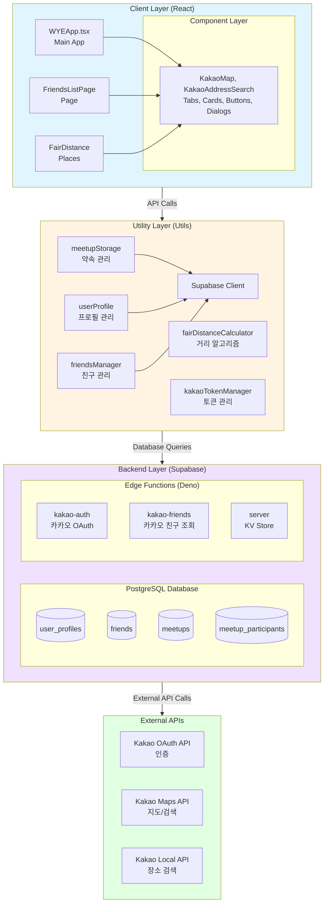
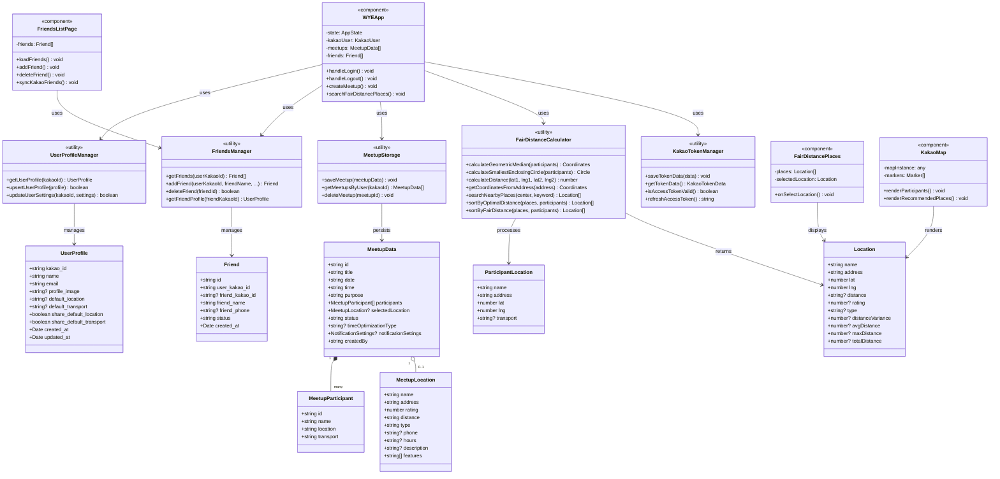
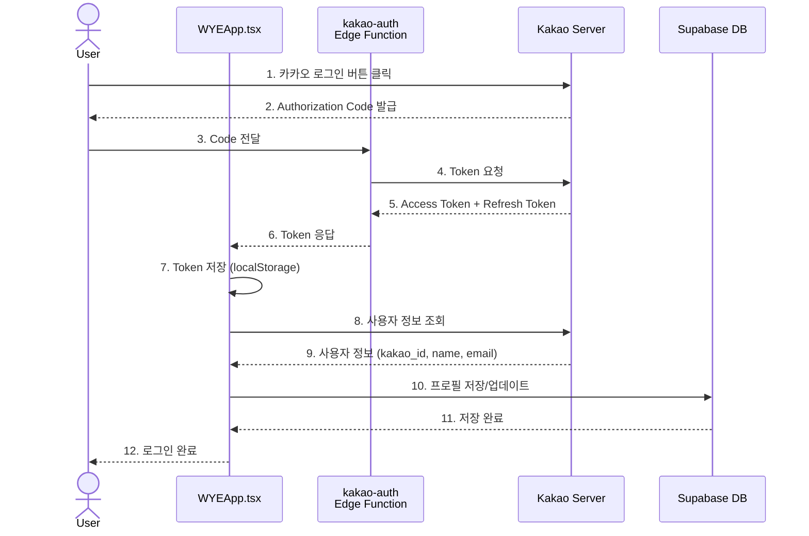
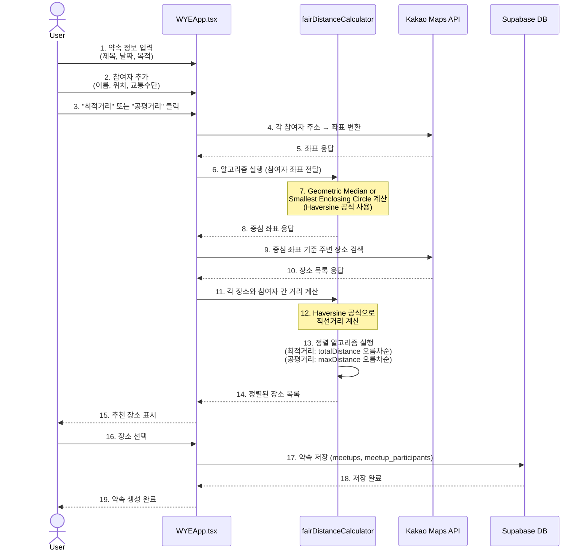
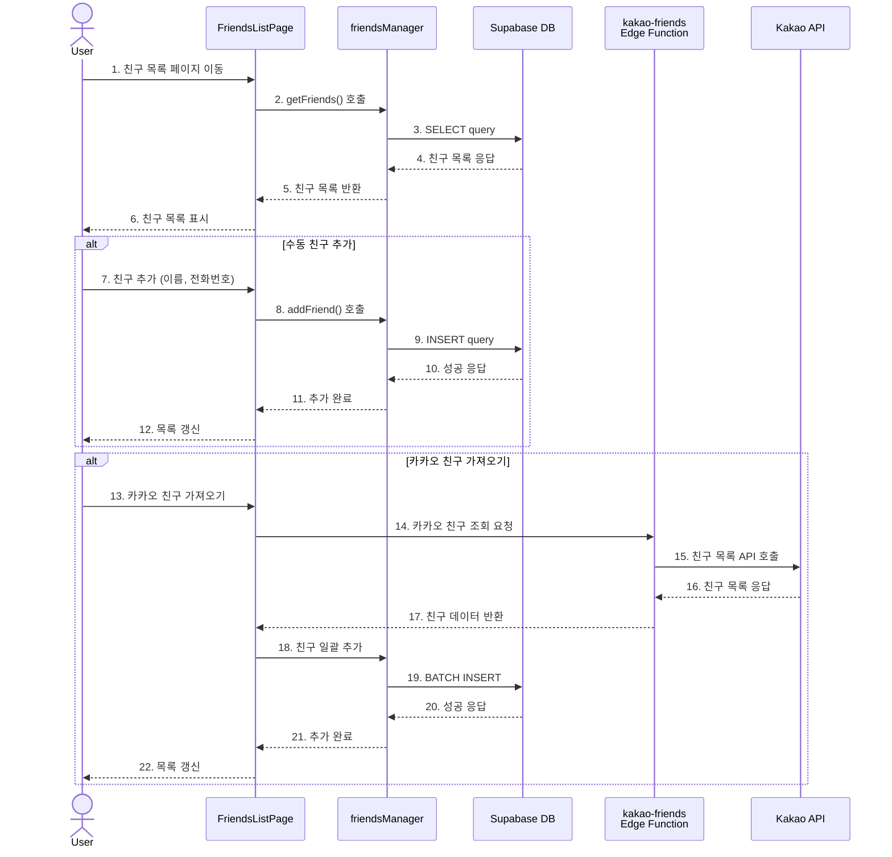
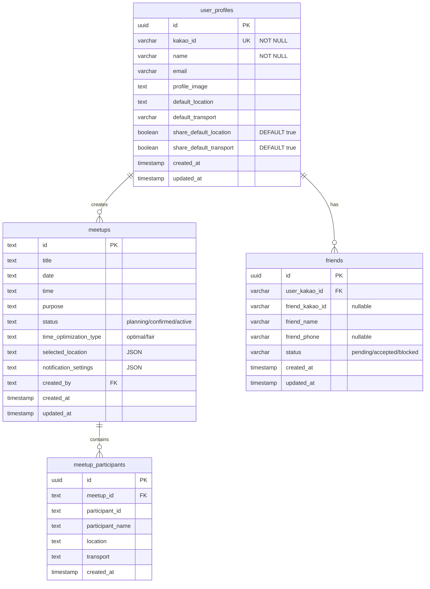

# WYE 프로젝트 설계 문서 (Architecture Design Document)

## 목차
1. [프로젝트 개요](#1-프로젝트-개요)
2. [전체 시스템 아키텍처](#2-전체-시스템-아키텍처)
3. [모듈 구성 및 상호작용](#3-모듈-구성-및-상호작용)
4. [클래스 다이어그램](#4-클래스-다이어그램)
5. [데이터 플로우 다이어그램](#5-데이터-플로우-다이어그램)
6. [E-R 다이어그램](#6-e-r-다이어그램)
7. [핵심 알고리즘](#7-핵심-알고리즘)
8. [API 연동](#8-api-연동)

---

## 1. 프로젝트 개요

### 1.1 서비스 명
**WYE** (Where You meet Everyone)

### 1.2 목적
여러 사람이 만날 때 모든 참여자의 위치를 고려하여 최적의 약속 장소를 추천하는 웹 애플리케이션

### 1.3 핵심 기능
- 카카오 소셜 로그인
- 친구 관리 (카카오 친구 불러오기, 수동 추가)
- 약속 생성 및 참여자 관리
- **Haversine 공식 기반** 거리 계산 (직선거리)
- 두 가지 추천 알고리즘:
  - **최적거리**: Geometric Median (거리 합 최소화)
  - **공평거리**: Smallest Enclosing Circle (가장 먼 사람의 거리 최소화)
- 카카오맵 연동 시각화

### 1.4 기술 스택
- **Frontend**: React + TypeScript, Tailwind CSS
- **Backend**: Supabase (PostgreSQL + Edge Functions)
- **인증**: Kakao OAuth 2.0
- **지도/장소 검색**: Kakao Maps API, Kakao Local API
- **거리 계산**: Haversine 공식 (직선거리)

---

## 2. 전체 시스템 아키텍처



---

## 3. 모듈 구성 및 상호작용

### 3.1 Presentation Layer (Components)

#### 3.1.1 WYEApp.tsx
**역할**: 메인 애플리케이션 컨테이너, 전체 상태 관리
**주요 기능**:
- 카카오 로그인/로그아웃
- 사용자 프로필 관리
- 약속 생성 및 목록 표시
- 참여자 관리
- 장소 추천 트리거

**상호작용**:
```
WYEApp ──> userProfile.tsx (프로필 조회/저장)
       ──> meetupStorage.tsx (약속 저장/조회)
       ──> friendsManager.tsx (친구 목록)
       ──> kakaoTokenManager.tsx (토큰 관리)
       ──> fairDistanceCalculator.tsx (알고리즘 실행)
```

#### 3.1.2 FriendsListPage.tsx
**역할**: 친구 관리 UI
**주요 기능**:
- 친구 목록 표시
- 카카오 친구 가져오기
- 수동 친구 추가/삭제

**상호작용**:
```
FriendsListPage ──> friendsManager.tsx (CRUD)
                ──> kakao-friends Edge Function (카카오 API)
```

#### 3.1.3 FairDistancePlaces.tsx
**역할**: 추천 장소 목록 표시
**주요 기능**:
- 최적거리/공평거리 장소 목록
- 장소 선택
- 상세 정보 표시

#### 3.1.4 KakaoMap.tsx
**역할**: 지도 시각화
**주요 기능**:
- 참여자 위치 마커 표시
- 추천 장소 마커 표시
- 마커 클릭 이벤트

#### 3.1.5 KakaoAddressSearch.tsx
**역할**: 주소 검색 인터페이스
**주요 기능**:
- 카카오 장소 검색 API 호출
- 검색 결과 표시
- 좌표 변환

---

### 3.2 Business Logic Layer (Utils)

#### 3.2.1 fairDistanceCalculator.tsx
**역할**: 거리 계산 및 최적화 알고리즘
**핵심 함수**:

```typescript
// Geometric Median 계산 (최적거리)
calculateGeometricMedian(participants: ParticipantLocation[]): {lat, lng}

// Smallest Enclosing Circle 계산 (공평거리)
calculateSmallestEnclosingCircle(participants: ParticipantLocation[]): {lat, lng, radius}

// Haversine 직선거리 계산
calculateDistance(lat1, lng1, lat2, lng2): number

// 카카오 주소/장소 검색
getCoordinatesFromAddress(address: string): Promise<{lat, lng}>
searchNearbyPlaces(center: {lat, lng}, keyword: string): Promise<Location[]>

// 정렬 알고리즘
sortByOptimalDistance(places, participants): Location[]
sortByFairDistance(places, participants): Location[]
```

**알고리즘 상세**:
- **Weiszfeld 알고리즘**: 반복적으로 기하학적 중심에 수렴
- **Welzl 알고리즘**: 최소 원 계산 (재귀적)

#### 3.2.2 meetupStorage.tsx
**역할**: 약속 데이터 영속성 관리
**핵심 함수**:
```typescript
saveMeetup(meetupData: MeetupData): Promise<void>
getMeetupsByUser(kakaoId: string): Promise<MeetupData[]>
deleteMeetup(meetupId: string): Promise<void>
```

**데이터 흐름**:
```
WYEApp → saveMeetup() → Supabase.from('meetups').insert()
                      → Supabase.from('meetup_participants').insert()
```

#### 3.2.3 userProfile.tsx
**역할**: 사용자 프로필 관리
**핵심 함수**:
```typescript
getUserProfile(kakaoId: string): Promise<UserProfile | null>
upsertUserProfile(profile: UserProfile): Promise<boolean>
updateUserSettings(kakaoId, settings): Promise<boolean>
```

#### 3.2.4 friendsManager.tsx
**역할**: 친구 관계 관리
**핵심 함수**:
```typescript
getFriends(userKakaoId: string): Promise<Friend[]>
addFriend(userKakaoId, friendName, friendPhone, friendKakaoId): Promise<Friend>
deleteFriend(friendId: string): Promise<void>
getFriendProfile(friendKakaoId: string): Promise<UserProfile | null>
```

#### 3.2.5 kakaoTokenManager.tsx
**역할**: 카카오 OAuth 토큰 생명주기 관리
**핵심 함수**:
```typescript
saveTokenData(data: {accessToken, refreshToken, expiresIn}): void
getTokenData(): KakaoTokenData | null
isAccessTokenValid(): boolean
isRefreshTokenValid(): boolean
getAccessToken(): string | null
refreshAccessToken(): Promise<string | null>
```

**토큰 갱신 로직**:
```
1. getAccessToken() 호출
2. isAccessTokenValid() 체크
3. 만료 임박 → refreshAccessToken() 호출
4. Refresh Token으로 새 Access Token 발급
5. saveTokenData()로 저장
```

---

### 3.3 Data Access Layer (Supabase)

#### 3.3.1 Database Schema

**user_profiles**
```sql
- id (PK, UUID)
- kakao_id (UNIQUE NOT NULL, TEXT)
- name (TEXT NOT NULL)
- email (TEXT)
- profile_image (TEXT)
- default_location (TEXT)
- default_transport (TEXT)
- share_default_location (BOOLEAN DEFAULT true)
- share_default_transport (BOOLEAN DEFAULT true)
- created_at (TIMESTAMP)
- updated_at (TIMESTAMP)
```

**friends**
```sql
- id (PK, UUID)
- user_kakao_id (TEXT)
- friend_kakao_id (TEXT, nullable)
- friend_name (TEXT)
- friend_phone (TEXT, nullable)
- status (TEXT: pending/accepted/blocked)
- created_at (TIMESTAMP)
```

**meetups**
```sql
- id (PK, TEXT)
- title (TEXT)
- date (TEXT)
- time (TEXT)
- purpose (TEXT)
- status (TEXT: planning/confirmed/active)
- time_optimization_type (TEXT: optimal/fair)
- selected_location (TEXT, JSON)
- notification_settings (TEXT, JSON)
- created_by (TEXT, kakao_id)
- created_at (TIMESTAMP)
- updated_at (TIMESTAMP)
```

**meetup_participants**
```sql
- id (PK, UUID)
- meetup_id (FK → meetups.id)
- participant_id (TEXT, kakao_id)
- participant_name (TEXT)
- location (TEXT)
- transport (TEXT)
- created_at (TIMESTAMP)
```

#### 3.3.2 Edge Functions

**kakao-auth**
```typescript
// Authorization Code → Access Token 교환
POST /kakao-auth
Body: { code, redirectUri }
Response: { accessToken, refreshToken, expiresIn, userId }

// Refresh Token → 새 Access Token
POST /kakao-auth
Body: { grantType: "refresh_token", refreshToken }
Response: { accessToken, refreshToken, expiresIn }
```

**kakao-friends**
```typescript
// 카카오 친구 목록 조회
POST /kakao-friends
Body: { accessToken }
Response: { friends: Friend[] }
```

---

## 4. 클래스 다이어그램



---

## 5. 데이터 플로우 다이어그램

### 5.1 로그인 플로우



### 5.2 약속 생성 및 장소 추천 플로우



### 5.3 친구 관리 플로우



---

## 6. E-R 다이어그램



**관계 설명**:

1. **user_profiles ─(1:N)─> meetups**
   - 한 사용자는 여러 약속을 생성할 수 있음
   - `meetups.created_by` → `user_profiles.kakao_id`

2. **meetups ─(1:N)─> meetup_participants**
   - 한 약속에는 여러 참여자가 포함됨
   - `meetup_participants.meetup_id` → `meetups.id`
   - CASCADE DELETE: 약속 삭제 시 참여자도 삭제

3. **user_profiles ─(1:N)─> friends**
   - 한 사용자는 여러 친구를 가질 수 있음
   - `friends.user_kakao_id` → `user_profiles.kakao_id`

4. **friends.friend_kakao_id → user_profiles.kakao_id** (논리적 관계)
   - 친구가 WYE 사용자인 경우 프로필 참조
   - NULL 가능 (비사용자 친구)

---

## 7. 핵심 알고리즘

### 7.1 최적거리 알고리즘 (Geometric Median)

**목적**: 모든 참여자까지의 거리 합을 최소화하는 지점 찾기

**알고리즘**: Weiszfeld Algorithm
```
Input: participants[] with {lat, lng}
Output: {lat, lng} of optimal point

1. Initialize: 
   current = geometric center of all participants

2. Iterate (max 100 times):
   numeratorLat = 0, numeratorLng = 0, denominator = 0
   
   For each participant p:
     distance = haversineDistance(current, p)
     weight = 1 / distance
     numeratorLat += p.lat * weight
     numeratorLng += p.lng * weight
     denominator += weight
   
   newLat = numeratorLat / denominator
   newLng = numeratorLng / denominator
   
   If change < tolerance:
     CONVERGED → return {newLat, newLng}
   
   current = {newLat, newLng}

3. Return current point
```

**장소 정렬 (최적거리/공평거리 공통)**:
```
For each place:
  totalDistance = 0
  distances = []
  
  For each participant:
    distance = calculateDistance(participant.lat, participant.lng, place.lat, place.lng)
    distances.push(distance)
    totalDistance += distance
  
  place.totalDistance = totalDistance
  place.avgDistance = totalDistance / participants.length
  place.maxDistance = max(distances)
  place.minDistance = min(distances)
  place.distanceVariance = stdDeviation(distances)

최적거리 정렬:
  Sort by totalDistance (ascending)

공평거리 정렬:
  Sort by maxDistance (ascending)
  If tied → sort by distanceVariance (ascending)
```

---

### 7.2 공평거리 알고리즘 (Smallest Enclosing Circle)

**목적**: 가장 먼 참여자의 거리를 최소화하는 지점 찾기

**알고리즘**: Welzl's Algorithm (재귀적 최소 원 계산)
```
Input: participants[]
Output: {lat, lng, radius} of smallest circle

Function welzl(P, R, n):
  If n == 0 or |R| == 3:
    return trivialCircle(R)
  
  p = P[n-1]
  circle = welzl(P, R, n-1)
  
  If p is inside circle:
    return circle
  
  Return welzl(P, R ∪ {p}, n-1)

Function trivialCircle(points):
  If |points| == 0:
    return {center: {0,0}, radius: 0}
  If |points| == 1:
    return {center: points[0], radius: 0}
  If |points| == 2:
    return circle from diameter
  If |points| == 3:
    return circumcircle of triangle
```

**장소 정렬**: 7.3의 공통 정렬 알고리즘 참조

---

### 7.3 Haversine 공식

**목적**: 두 지점 간의 직선 거리 계산 (구면 거리)

**공식**:
```
R = 6371 (지구 반지름, km)

dLat = (lat2 - lat1) × π / 180
dLng = (lng2 - lng1) × π / 180

a = sin²(dLat/2) + cos(lat1) × cos(lat2) × sin²(dLng/2)
c = 2 × atan2(√a, √(1-a))

distance = R × c
```

**특징**:
- 지구를 완전한 구로 가정
- 오차: 0.5% 이내 (실제 지구는 타원체)
- 계산 속도: 매우 빠름 (삼각함수만 사용)
- 실제 이동 거리보다 짧음 (직선거리)

**장소 정렬 (최적거리/공평거리 공통)**:
```
For each place:
  totalDistance = 0
  distances = []
  
  For each participant:
    distance = calculateDistance(participant.lat, participant.lng, place.lat, place.lng)
    distances.push(distance)
    totalDistance += distance
  
  place.totalDistance = totalDistance
  place.avgDistance = totalDistance / participants.length
  place.maxDistance = max(distances)
  place.minDistance = min(distances)
  place.distanceVariance = stdDeviation(distances)

최적거리 정렬:
  Sort by totalDistance (ascending)

공평거리 정렬:
  Sort by maxDistance (ascending)
  If tied → sort by distanceVariance (ascending)
```

---

## 8. API 연동

### 8.1 Kakao OAuth API

**인증 플로우**:
```
1. Authorization Request
   GET https://kauth.kakao.com/oauth/authorize
   ?client_id={REST_API_KEY}
   &redirect_uri={REDIRECT_URI}
   &response_type=code

2. Token Request (via Edge Function)
   POST https://kauth.kakao.com/oauth/token
   Body: {
     grant_type: "authorization_code",
     client_id: {REST_API_KEY},
     client_secret: {SECRET},
     redirect_uri: {REDIRECT_URI},
     code: {AUTH_CODE}
   }
   Response: {
     access_token,
     refresh_token,
     expires_in,
     refresh_token_expires_in
   }

3. Refresh Token
   POST https://kauth.kakao.com/oauth/token
   Body: {
     grant_type: "refresh_token",
     client_id: {REST_API_KEY},
     refresh_token: {REFRESH_TOKEN}
   }
```

### 8.2 Kakao Maps & Local API

**장소 검색** (keywordSearch):
```javascript
kakao.maps.services.Places.keywordSearch(
  keyword,
  callback,
  {
    location: new kakao.maps.LatLng(lat, lng),
    radius: 3000,  // 검색 반경 (미터)
    size: 15       // 결과 개수
  }
)
```

**주소 → 좌표 변환** (Geocoder):
```javascript
kakao.maps.services.Geocoder.addressSearch(
  address,
  (result, status) => {
    if (status === kakao.maps.services.Status.OK) {
      return { lat: result[0].y, lng: result[0].x }
    }
  }
)
```

---
