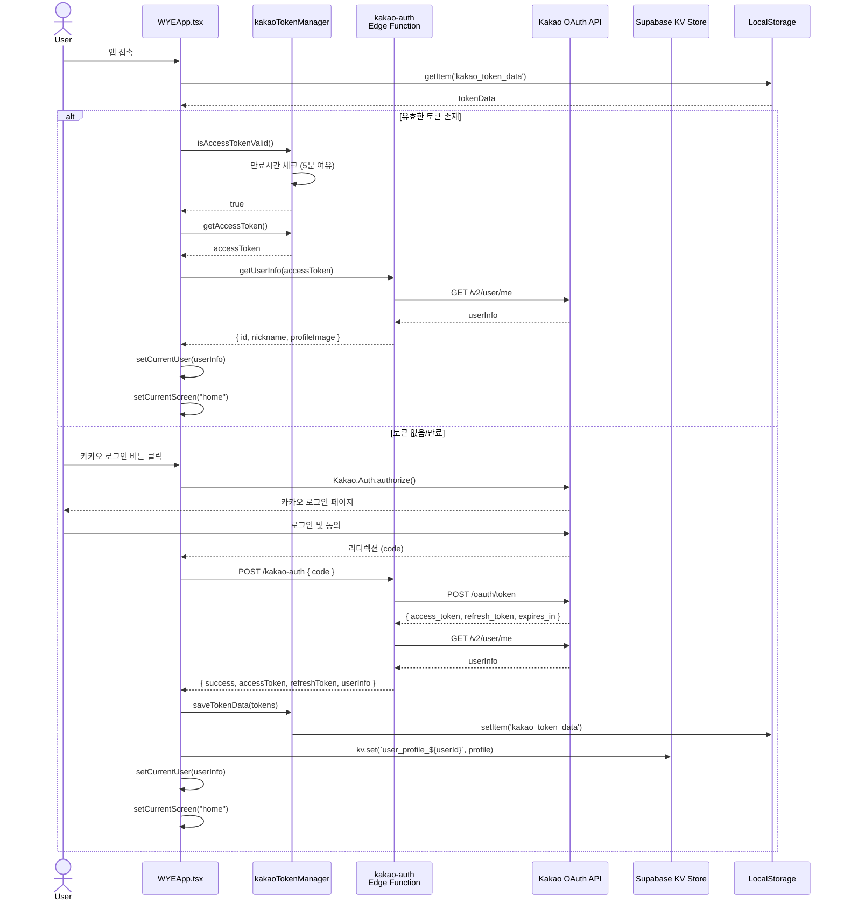
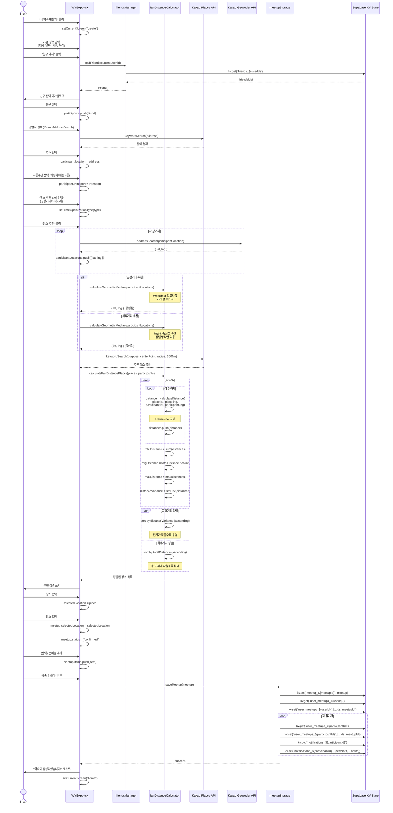
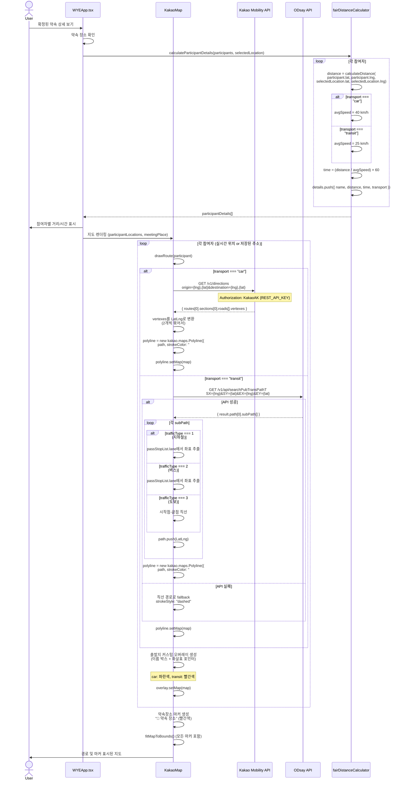
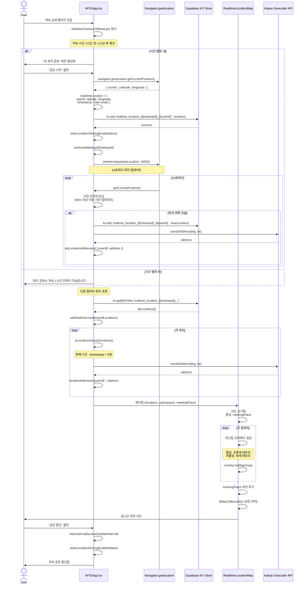
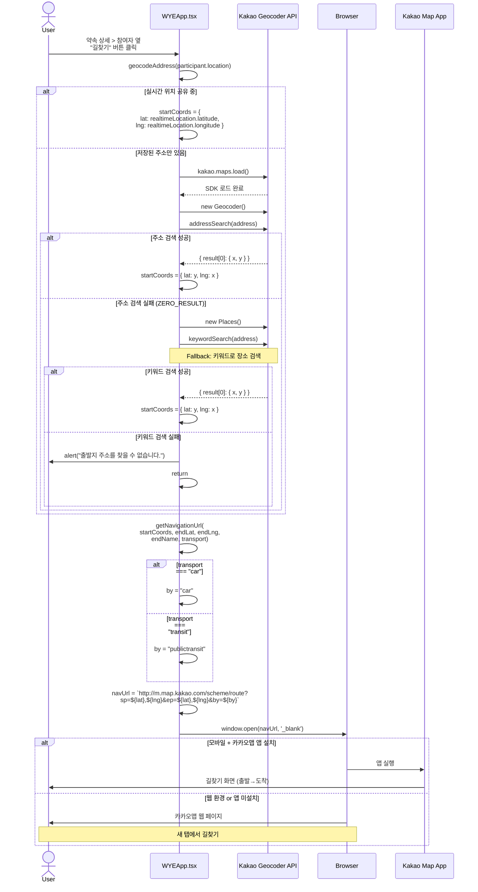
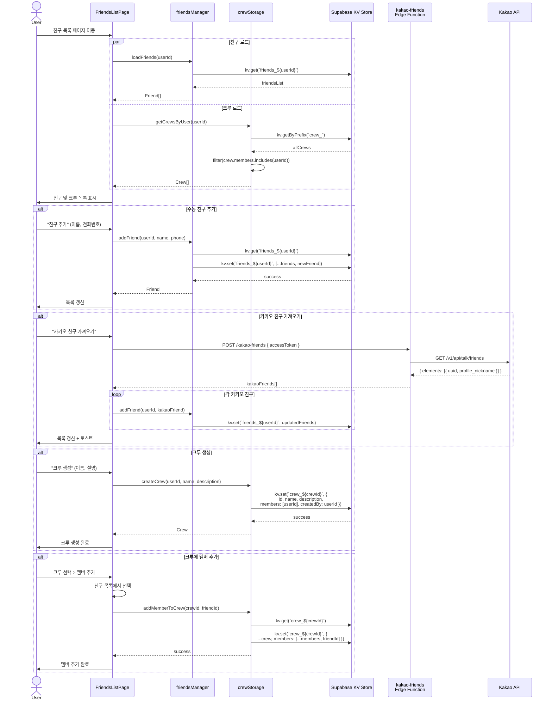
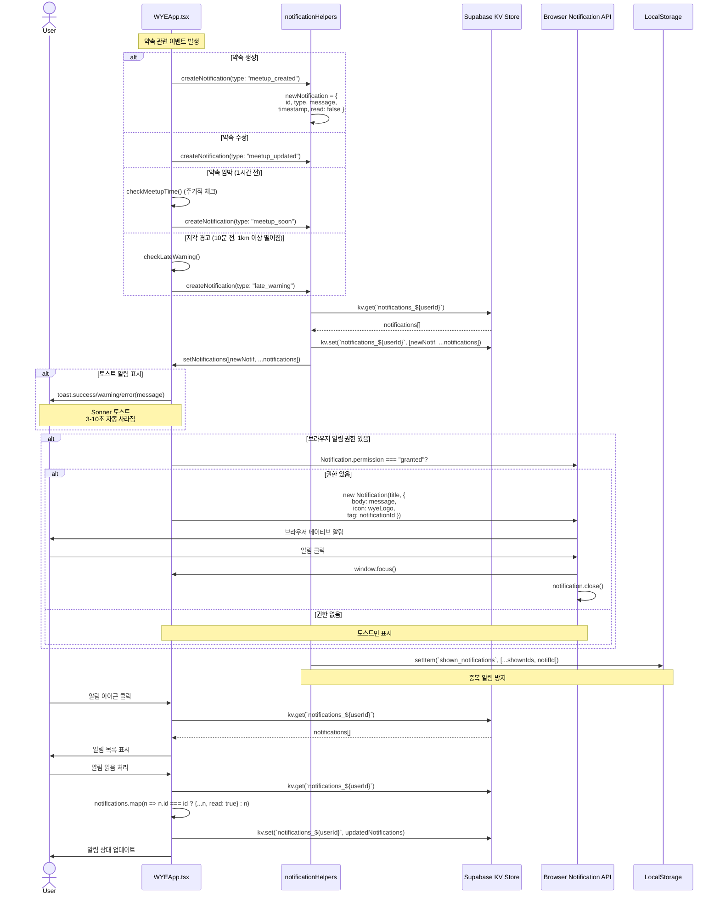
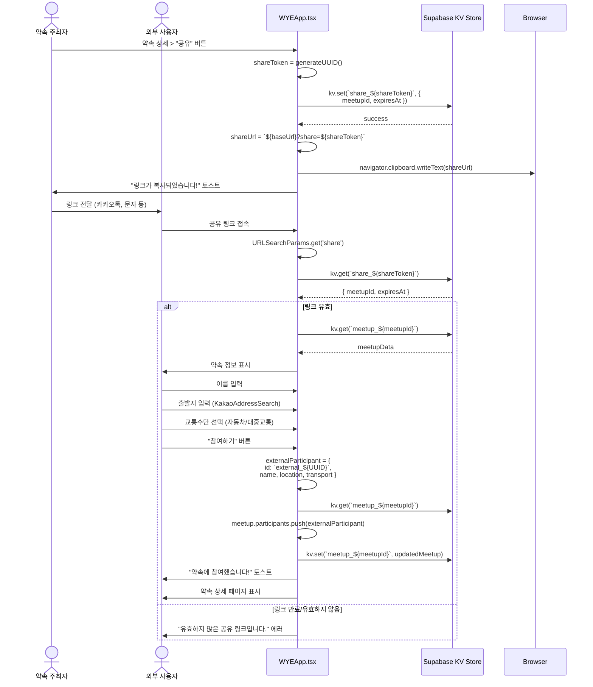

# WYE (Where You @) - 데이터 플로우 다이어그램

## 1. 로그인 및 인증 플로우

```mermaid
sequenceDiagram
    actor User
    participant WYE as WYEApp.tsx
    participant TokenMgr as kakaoTokenManager
    participant EdgeFn as kakao-auth<br/>Edge Function
    participant KakaoAPI as Kakao OAuth API
    participant SupabaseKV as Supabase KV Store
    participant LocalStorage

    User->>WYE: 앱 접속
    WYE->>LocalStorage: getItem('kakao_token_data')
    LocalStorage-->>WYE: tokenData
    
    alt 유효한 토큰 존재
        WYE->>TokenMgr: isAccessTokenValid()
        TokenMgr->>TokenMgr: 만료시간 체크 (5분 여유)
        TokenMgr-->>WYE: true
        WYE->>TokenMgr: getAccessToken()
        TokenMgr-->>WYE: accessToken
        WYE->>EdgeFn: getUserInfo(accessToken)
        EdgeFn->>KakaoAPI: GET /v2/user/me
        KakaoAPI-->>EdgeFn: userInfo
        EdgeFn-->>WYE: { id, nickname, profileImage }
        WYE->>WYE: setCurrentUser(userInfo)
        WYE->>WYE: setCurrentScreen("home")
    else 토큰 없음/만료
        User->>WYE: 카카오 로그인 버튼 클릭
        WYE->>KakaoAPI: Kakao.Auth.authorize()
        KakaoAPI-->>User: 카카오 로그인 페이지
        User->>KakaoAPI: 로그인 및 동의
        KakaoAPI-->>WYE: 리디렉션 (code)
        WYE->>EdgeFn: POST /kakao-auth { code }
        EdgeFn->>KakaoAPI: POST /oauth/token
        KakaoAPI-->>EdgeFn: { access_token, refresh_token, expires_in }
        EdgeFn->>KakaoAPI: GET /v2/user/me
        KakaoAPI-->>EdgeFn: userInfo
        EdgeFn-->>WYE: { success, accessToken, refreshToken, userInfo }
        WYE->>TokenMgr: saveTokenData(tokens)
        TokenMgr->>LocalStorage: setItem('kakao_token_data')
        WYE->>SupabaseKV: kv.set(`user_profile_${userId}`, profile)
        WYE->>WYE: setCurrentUser(userInfo)
        WYE->>WYE: setCurrentScreen("home")
    end
```

## 2. 약속 생성 및 장소 추천 플로우

```mermaid
sequenceDiagram
    actor User
    participant WYE as WYEApp.tsx
    participant FriendsMgr as friendsManager
    participant Calc as fairDistanceCalculator
    participant KakaoPlaces as Kakao Places API
    participant KakaoGeocoder as Kakao Geocoder API
    participant MeetupStorage as meetupStorage
    participant SupabaseKV as Supabase KV Store

    User->>WYE: "새 약속 만들기" 클릭
    WYE->>WYE: setCurrentScreen("create")
    
    User->>WYE: 기본 정보 입력<br/>(제목, 날짜, 시간, 목적)
    
    User->>WYE: "친구 추가" 클릭
    WYE->>FriendsMgr: loadFriends(currentUser.id)
    FriendsMgr->>SupabaseKV: kv.get(`friends_${userId}`)
    SupabaseKV-->>FriendsMgr: friendsList
    FriendsMgr-->>WYE: Friend[]
    WYE->>User: 친구 선택 다이얼로그
    
    User->>WYE: 친구 선택
    WYE->>WYE: participants.push(friend)
    
    User->>WYE: 출발지 검색 (KakaoAddressSearch)
    WYE->>KakaoPlaces: keywordSearch(address)
    KakaoPlaces-->>WYE: 검색 결과
    User->>WYE: 주소 선택
    WYE->>WYE: participant.location = address
    
    User->>WYE: 교통수단 선택 (자동차/대중교통)
    WYE->>WYE: participant.transport = transport
    
    User->>WYE: "장소 추천 방식 선택"<br/>(공평거리/최적거리)
    WYE->>WYE: setTimeOptimizationType(type)
    
    User->>WYE: "장소 추천" 클릭
    
    loop 각 참여자
        WYE->>KakaoGeocoder: addressSearch(participant.location)
        KakaoGeocoder-->>WYE: { lat, lng }
        WYE->>WYE: participantLocations.push({ lat, lng })
    end
    
    alt 공평거리 추천
        WYE->>Calc: calculateGeometricMedian(participantLocations)
        Note over Calc: Weiszfeld 알고리즘<br/>거리 합 최소화
        Calc-->>WYE: { lat, lng } (중심점)
    else 최적거리 추천
        WYE->>Calc: calculateGeometricMedian(participantLocations)
        Note over Calc: 동일한 중심점 계산<br/>정렬 방식만 다름
        Calc-->>WYE: { lat, lng } (중심점)
    end
    
    WYE->>KakaoPlaces: keywordSearch(purpose, centerPoint, radius: 3000m)
    KakaoPlaces-->>WYE: 주변 장소 목록
    
    WYE->>Calc: calculateFairDistancePlaces(places, participants)
    
    loop 각 장소
        loop 각 참여자
            Calc->>Calc: distance = calculateDistance(<br/>place.lat, place.lng,<br/>participant.lat, participant.lng)
            Note over Calc: Haversine 공식
            Calc->>Calc: distances.push(distance)
        end
        Calc->>Calc: totalDistance = sum(distances)
        Calc->>Calc: avgDistance = totalDistance / count
        Calc->>Calc: maxDistance = max(distances)
        Calc->>Calc: distanceVariance = stdDev(distances)
    end
    
    alt 공평거리 정렬
        Calc->>Calc: sort by distanceVariance (ascending)
        Note over Calc: 편차가 작을수록 공평
    else 최적거리 정렬
        Calc->>Calc: sort by totalDistance (ascending)
        Note over Calc: 총 거리가 작을수록 최적
    end
    
    Calc-->>WYE: 정렬된 장소 목록
    WYE->>User: 추천 장소 표시
    
    User->>WYE: 장소 선택
    WYE->>WYE: selectedLocation = place
    
    User->>WYE: 장소 확정
    WYE->>WYE: meetup.selectedLocation = selectedLocation
    WYE->>WYE: meetup.status = "confirmed"
    
    User->>WYE: (선택) 준비물 추가
    WYE->>WYE: meetup.items.push(item)
    
    User->>WYE: "약속 만들기" 버튼
    
    WYE->>MeetupStorage: saveMeetup(meetup)
    MeetupStorage->>SupabaseKV: kv.set(`meetup_${meetupId}`, meetup)
    MeetupStorage->>SupabaseKV: kv.get(`user_meetups_${userId}`)
    MeetupStorage->>SupabaseKV: kv.set(`user_meetups_${userId}`, [...ids, meetupId])
    
    loop 각 참여자
        MeetupStorage->>SupabaseKV: kv.get(`user_meetups_${participantId}`)
        MeetupStorage->>SupabaseKV: kv.set(`user_meetups_${participantId}`, [...ids, meetupId])
        MeetupStorage->>SupabaseKV: kv.get(`notifications_${participantId}`)
        MeetupStorage->>SupabaseKV: kv.set(`notifications_${participantId}`, [newNotif, ...notifs])
    end
    
    MeetupStorage-->>WYE: success
    WYE->>User: "약속이 생성되었습니다!" 토스트
    WYE->>WYE: setCurrentScreen("home")
```

## 3. 경로 표시 플로우

```mermaid
sequenceDiagram
    actor User
    participant WYE as WYEApp.tsx
    participant KakaoMap
    participant KakaoMobility as Kakao Mobility API
    participant ODsayAPI as ODsay API
    participant Calc as fairDistanceCalculator

    User->>WYE: 확정된 약속 상세 보기
    WYE->>WYE: 약속 장소 확인
    
    WYE->>Calc: calculateParticipantDetails(participants, selectedLocation)
    
    loop 각 참여자
        Calc->>Calc: distance = calculateDistance(<br/>participant.lat, participant.lng,<br/>selectedLocation.lat, selectedLocation.lng)
        
        alt transport === "car"
            Calc->>Calc: avgSpeed = 40 km/h
        else transport === "transit"
            Calc->>Calc: avgSpeed = 25 km/h
        end
        
        Calc->>Calc: time = (distance / avgSpeed) × 60
        Calc->>Calc: details.push({ name, distance, time, transport })
    end
    
    Calc-->>WYE: participantDetails[]
    WYE->>User: 참여자별 거리/시간 표시
    
    WYE->>KakaoMap: 지도 렌더링 (participantLocations, meetingPlace)
    
    loop 각 참여자 (실시간 위치 or 저장된 주소)
        KakaoMap->>KakaoMap: drawRoute(participant)
        
        alt transport === "car"
            KakaoMap->>KakaoMobility: GET /v1/directions<br/>origin={lng},{lat}&destination={lng},{lat}
            Note over KakaoMobility: Authorization: KakaoAK {REST_API_KEY}
            
            KakaoMobility-->>KakaoMap: { routes[0].sections[0].roads[].vertexes }
            
            KakaoMap->>KakaoMap: vertexes를 LatLng로 변환<br/>(2개씩 묶어서)
            KakaoMap->>KakaoMap: polyline = new kakao.maps.Polyline({<br/>path, strokeColor: "#3b82f6",<br/>strokeWeight: 4 })
            KakaoMap->>KakaoMap: polyline.setMap(map)
            
        else transport === "transit"
            KakaoMap->>ODsayAPI: GET /v1/api/searchPubTransPathT<br/>SX={lng}&SY={lat}&EX={lng}&EY={lat}
            
            alt API 성공
                ODsayAPI-->>KakaoMap: { result.path[0].subPath[] }
                
                loop 각 subPath
                    alt trafficType === 1 (지하철)
                        KakaoMap->>KakaoMap: passStopList.lane에서 좌표 추출
                    else trafficType === 2 (버스)
                        KakaoMap->>KakaoMap: passStopList.lane에서 좌표 추출
                    else trafficType === 3 (도보)
                        KakaoMap->>KakaoMap: 시작점-끝점 직선
                    end
                    KakaoMap->>KakaoMap: path.push(LatLng)
                end
                
                KakaoMap->>KakaoMap: polyline = new kakao.maps.Polyline({<br/>path, strokeColor: "#ef4444",<br/>strokeWeight: 4 })
                
            else API 실패
                KakaoMap->>KakaoMap: 직선 경로로 fallback<br/>strokeStyle: "dashed"
            end
            
            KakaoMap->>KakaoMap: polyline.setMap(map)
        end
        
        KakaoMap->>KakaoMap: 출발지 커스텀 오버레이 생성<br/>(이름 박스 + 화살표 포인터)
        Note over KakaoMap: car: 파란색, transit: 빨간색
        KakaoMap->>KakaoMap: overlay.setMap(map)
    end
    
    KakaoMap->>KakaoMap: 약속장소 마커 생성<br/>"📍 약속 장소" (빨간색)
    KakaoMap->>KakaoMap: fitMapToBounds() (모든 마커 포함)
    
    KakaoMap->>User: 경로 및 마커 표시된 지도
```

## 4. 실시간 위치 공유 플로우

```mermaid
sequenceDiagram
    actor User
    participant WYE as WYEApp.tsx
    participant Browser as Navigator.geolocation
    participant SupabaseKV as Supabase KV Store
    participant RealtimeMap as RealtimeLocationMap
    participant KakaoGeocoder as Kakao Geocoder API

    User->>WYE: 약속 상세 페이지 진입
    WYE->>WYE: isWithinOneHourOfMeetup() 체크
    Note over WYE: 약속 시간 1시간 전~1시간 후 체크
    
    alt 시간 범위 내
        WYE->>User: "내 위치 공유" 버튼 활성화
        
        User->>WYE: "공유 시작" 클릭
        WYE->>Browser: navigator.geolocation.getCurrentPosition()
        
        Browser-->>WYE: { coords: { latitude, longitude } }
        
        WYE->>WYE: realtimeLocation = {<br/>userId, latitude, longitude,<br/>timestamp: Date.now() }
        
        WYE->>SupabaseKV: kv.set(`realtime_location_${meetupId}_${userId}`, location)
        SupabaseKV-->>WYE: success
        
        WYE->>WYE: setIsLocationSharingEnabled(true)
        WYE->>WYE: setActiveMeetupId(meetupId)
        
        WYE->>Browser: setInterval(updateLocation, 10000)
        Note over WYE,Browser: 10초마다 위치 업데이트
        
        loop 10초마다
            Browser->>WYE: getCurrentPosition()
            
            WYE->>WYE: 이전 위치와 비교<br/>(50m 이상 이동 시만 업데이트)
            
            alt 위치 변화 있음
                WYE->>SupabaseKV: kv.set(`realtime_location_${meetupId}_${userId}`, newLocation)
                WYE->>KakaoGeocoder: coord2Address(lng, lat)
                KakaoGeocoder-->>WYE: address
                WYE->>WYE: setLocationAddresses({ [userId]: address })
            end
        end
        
    else 시간 범위 외
        WYE->>User: "위치 공유는 약속 1시간 전부터 가능합니다"
    end
    
    Note over WYE: 다른 참여자 위치 조회
    
    WYE->>SupabaseKV: kv.getByPrefix(`realtime_location_${meetupId}_`)
    SupabaseKV-->>WYE: allLocations[]
    
    WYE->>WYE: setRealtimeLocations(allLocations)
    
    loop 각 위치
        WYE->>WYE: isLocationActive(timestamp)
        Note over WYE: 현재 시간 - timestamp < 5분
        
        WYE->>KakaoGeocoder: coord2Address(lng, lat)
        KakaoGeocoder-->>WYE: address
        WYE->>WYE: locationAddresses[userId] = address
    end
    
    WYE->>RealtimeMap: 렌더링 (locations, participants, meetingPlace)
    
    RealtimeMap->>RealtimeMap: 지도 초기화<br/>중심: meetingPlace
    
    loop 각 참여자
        RealtimeMap->>RealtimeMap: 커스텀 오버레이 생성
        Note over RealtimeMap: 활성: 초록색 테두리<br/>비활성: 회색 테두리
        RealtimeMap->>RealtimeMap: overlay.setMap(map)
    end
    
    RealtimeMap->>RealtimeMap: meetingPlace 마커 추가
    RealtimeMap->>RealtimeMap: fitMapToBounds() (모든 마커)
    
    RealtimeMap->>User: 실시간 위치 지도
    
    User->>WYE: "공유 중단" 클릭
    WYE->>WYE: clearInterval(locationUpdateInterval)
    WYE->>WYE: setIsLocationSharingEnabled(false)
    WYE->>User: 위치 공유 중단됨
```

## 5. 길찾기 플로우

```mermaid
sequenceDiagram
    actor User
    participant WYE as WYEApp.tsx
    participant KakaoGeocoder as Kakao Geocoder API
    participant Browser
    participant KakaoMap as Kakao Map App

    User->>WYE: 약속 상세 > 참여자 옆<br/>"길찾기" 버튼 클릭
    
    WYE->>WYE: geocodeAddress(participant.location)
    
    alt 실시간 위치 공유 중
        WYE->>WYE: startCoords = {<br/>lat: realtimeLocation.latitude,<br/>lng: realtimeLocation.longitude }
        
    else 저장된 주소만 있음
        WYE->>KakaoGeocoder: kakao.maps.load()
        KakaoGeocoder-->>WYE: SDK 로드 완료
        
        WYE->>KakaoGeocoder: new Geocoder()
        WYE->>KakaoGeocoder: addressSearch(address)
        
        alt 주소 검색 성공
            KakaoGeocoder-->>WYE: { result[0]: { x, y } }
            WYE->>WYE: startCoords = { lat: y, lng: x }
            
        else 주소 검색 실패 (ZERO_RESULT)
            WYE->>KakaoGeocoder: new Places()
            WYE->>KakaoGeocoder: keywordSearch(address)
            Note over WYE,KakaoGeocoder: Fallback: 키워드로 장소 검색
            
            alt 키워드 검색 성공
                KakaoGeocoder-->>WYE: { result[0]: { x, y } }
                WYE->>WYE: startCoords = { lat: y, lng: x }
                
            else 키워드 검색 실패
                WYE->>User: alert("출발지 주소를 찾을 수 없습니다.")
                WYE->>WYE: return
            end
        end
    end
    
    WYE->>WYE: getNavigationUrl(<br/>startCoords, endLat, endLng,<br/>endName, transport)
    
    alt transport === "car"
        WYE->>WYE: by = "car"
    else transport === "transit"
        WYE->>WYE: by = "publictransit"
    end
    
    WYE->>WYE: navUrl = `http://m.map.kakao.com/scheme/route?<br/>sp=${lat},${lng}&ep=${lat},${lng}&by=${by}`
    
    WYE->>Browser: window.open(navUrl, '_blank')
    
    alt 모바일 + 카카오맵 앱 설치
        Browser->>KakaoMap: 앱 실행
        KakaoMap->>User: 길찾기 화면 (출발→도착)
        
    else 웹 환경 or 앱 미설치
        Browser->>User: 카카오맵 웹 페이지
        Note over Browser,User: 새 탭에서 길찾기
    end
```

## 6. 친구 및 크루 관리 플로우

```mermaid
sequenceDiagram
    actor User
    participant Friends as FriendsListPage
    participant FriendsMgr as friendsManager
    participant CrewMgr as crewStorage
    participant SupabaseKV as Supabase KV Store
    participant EdgeFn as kakao-friends<br/>Edge Function
    participant KakaoAPI as Kakao API

    User->>Friends: 친구 목록 페이지 이동
    
    par 친구 로드
        Friends->>FriendsMgr: loadFriends(userId)
        FriendsMgr->>SupabaseKV: kv.get(`friends_${userId}`)
        SupabaseKV-->>FriendsMgr: friendsList
        FriendsMgr-->>Friends: Friend[]
    and 크루 로드
        Friends->>CrewMgr: getCrewsByUser(userId)
        CrewMgr->>SupabaseKV: kv.getByPrefix(`crew_`)
        SupabaseKV-->>CrewMgr: allCrews
        CrewMgr->>CrewMgr: filter(crew.members.includes(userId))
        CrewMgr-->>Friends: Crew[]
    end
    
    Friends->>User: 친구 및 크루 목록 표시
    
    alt 수동 친구 추가
        User->>Friends: "친구 추가" (이름, 전화번호)
        Friends->>FriendsMgr: addFriend(userId, name, phone)
        FriendsMgr->>SupabaseKV: kv.get(`friends_${userId}`)
        FriendsMgr->>SupabaseKV: kv.set(`friends_${userId}`, [...friends, newFriend])
        SupabaseKV-->>FriendsMgr: success
        FriendsMgr-->>Friends: Friend
        Friends->>User: 목록 갱신
    end
    
    alt 카카오 친구 가져오기
        User->>Friends: "카카오 친구 가져오기"
        Friends->>EdgeFn: POST /kakao-friends { accessToken }
        EdgeFn->>KakaoAPI: GET /v1/api/talk/friends
        KakaoAPI-->>EdgeFn: { elements: [{ uuid, profile_nickname }] }
        EdgeFn-->>Friends: kakaoFriends[]
        
        loop 각 카카오 친구
            Friends->>FriendsMgr: addFriend(userId, kakaoFriend)
            FriendsMgr->>SupabaseKV: kv.set(`friends_${userId}`, updatedFriends)
        end
        
        Friends->>User: 목록 갱신 + 토스트
    end
    
    alt 크루 생성
        User->>Friends: "크루 생성" (이름, 설명)
        Friends->>CrewMgr: createCrew(userId, name, description)
        CrewMgr->>SupabaseKV: kv.set(`crew_${crewId}`, {<br/>id, name, description,<br/>members: [userId], createdBy: userId })
        SupabaseKV-->>CrewMgr: success
        CrewMgr-->>Friends: Crew
        Friends->>User: 크루 생성 완료
    end
    
    alt 크루에 멤버 추가
        User->>Friends: 크루 선택 > 멤버 추가
        Friends->>Friends: 친구 목록에서 선택
        Friends->>CrewMgr: addMemberToCrew(crewId, friendId)
        CrewMgr->>SupabaseKV: kv.get(`crew_${crewId}`)
        CrewMgr->>SupabaseKV: kv.set(`crew_${crewId}`, {<br/>...crew, members: [...members, friendId] })
        CrewMgr-->>Friends: success
        Friends->>User: 멤버 추가 완료
    end
```

## 7. 알림 플로우

```mermaid
sequenceDiagram
    actor User
    participant WYE as WYEApp.tsx
    participant NotifHelper as notificationHelpers
    participant SupabaseKV as Supabase KV Store
    participant Browser as Browser Notification API
    participant LocalStorage

    Note over WYE: 약속 관련 이벤트 발생
    
    alt 약속 생성
        WYE->>NotifHelper: createNotification(type: "meetup_created")
        NotifHelper->>NotifHelper: newNotification = {<br/>id, type, message,<br/>timestamp, read: false }
    else 약속 수정
        WYE->>NotifHelper: createNotification(type: "meetup_updated")
    else 약속 임박 (1시간 전)
        WYE->>WYE: checkMeetupTime() (주기적 체크)
        WYE->>NotifHelper: createNotification(type: "meetup_soon")
    else 지각 경고 (10분 전, 1km 이상 떨어짐)
        WYE->>WYE: checkLateWarning()
        WYE->>NotifHelper: createNotification(type: "late_warning")
    end
    
    NotifHelper->>SupabaseKV: kv.get(`notifications_${userId}`)
    SupabaseKV-->>NotifHelper: notifications[]
    NotifHelper->>SupabaseKV: kv.set(`notifications_${userId}`, [newNotif, ...notifications])
    
    NotifHelper->>WYE: setNotifications([newNotif, ...notifications])
    
    alt 토스트 알림 표시
        WYE->>User: toast.success/warning/error(message)
        Note over WYE,User: Sonner 토스트<br/>3-10초 자동 사라짐
    end
    
    alt 브라우저 알림 권한 있음
        WYE->>Browser: Notification.permission === "granted"?
        
        alt 권한 있음
            WYE->>Browser: new Notification(title, {<br/>body: message,<br/>icon: wyeLogo,<br/>tag: notificationId })
            Browser->>User: 브라우저 네이티브 알림
            
            User->>Browser: 알림 클릭
            Browser->>WYE: window.focus()
            Browser->>Browser: notification.close()
            
        else 권한 없음
            Note over WYE,Browser: 토스트만 표시
        end
    end
    
    NotifHelper->>LocalStorage: setItem(`shown_notifications`, [...shownIds, notifId])
    Note over NotifHelper,LocalStorage: 중복 알림 방지
    
    User->>WYE: 알림 아이콘 클릭
    WYE->>SupabaseKV: kv.get(`notifications_${userId}`)
    SupabaseKV-->>WYE: notifications[]
    WYE->>User: 알림 목록 표시
    
    User->>WYE: 알림 읽음 처리
    WYE->>SupabaseKV: kv.get(`notifications_${userId}`)
    WYE->>WYE: notifications.map(n => n.id === id ? {...n, read: true} : n)
    WYE->>SupabaseKV: kv.set(`notifications_${userId}`, updatedNotifications)
    WYE->>User: 알림 상태 업데이트
```

## 8. 외부 사용자 공유 플로우

```mermaid
sequenceDiagram
    actor Host as 약속 주최자
    actor External as 외부 사용자
    participant WYE as WYEApp.tsx
    participant SupabaseKV as Supabase KV Store
    participant Browser

    Host->>WYE: 약속 상세 > "공유" 버튼
    WYE->>WYE: shareToken = generateUUID()
    WYE->>SupabaseKV: kv.set(`share_${shareToken}`, {<br/>meetupId, expiresAt })
    SupabaseKV-->>WYE: success
    
    WYE->>WYE: shareUrl = `${baseUrl}?share=${shareToken}`
    WYE->>Browser: navigator.clipboard.writeText(shareUrl)
    WYE->>Host: "링크가 복사되었습니다!" 토스트
    
    Host->>External: 링크 전달 (카카오톡, 문자 등)
    
    External->>WYE: 공유 링크 접속
    WYE->>WYE: URLSearchParams.get('share')
    WYE->>SupabaseKV: kv.get(`share_${shareToken}`)
    SupabaseKV-->>WYE: { meetupId, expiresAt }
    
    alt 링크 유효
        WYE->>SupabaseKV: kv.get(`meetup_${meetupId}`)
        SupabaseKV-->>WYE: meetupData
        WYE->>External: 약속 정보 표시
        
        External->>WYE: 이름 입력
        External->>WYE: 출발지 입력 (KakaoAddressSearch)
        External->>WYE: 교통수단 선택 (자동차/대중교통)
        
        External->>WYE: "참여하기" 버튼
        
        WYE->>WYE: externalParticipant = {<br/>id: `external_${UUID}`,<br/>name, location, transport }
        
        WYE->>SupabaseKV: kv.get(`meetup_${meetupId}`)
        WYE->>WYE: meetup.participants.push(externalParticipant)
        WYE->>SupabaseKV: kv.set(`meetup_${meetupId}`, updatedMeetup)
        
        WYE->>External: "약속에 참여했습니다!" 토스트
        WYE->>External: 약속 상세 페이지 표시
        
    else 링크 만료/유효하지 않음
        WYE->>External: "유효하지 않은 공유 링크입니다." 에러
    end
```

## 9. 데이터 저장소 구조

```mermaid
graph LR
    subgraph "LocalStorage"
        TokenData[kakao_token_data<br/>{ accessToken, refreshToken,<br/>expiresIn, tokenSavedAt }]
        ShownNotifs[shown_notifications<br/>표시된 알림 ID 배열]
        LateChecked[lateCheckedMeetups<br/>지각 체크 완료 약속 Set]
        UnreadMeetups[unreadMeetups<br/>미확인 약속 Set]
    end
    
    subgraph "Supabase KV Store"
        UserProfile[user_profile_{userId}<br/>프로필 정보]
        UserMeetups[user_meetups_{userId}<br/>약속 ID 배열]
        Friends[friends_{userId}<br/>친구 목록]
        Crews[crew_{crewId}<br/>크루 정보]
        Meetup[meetup_{meetupId}<br/>약속 상세]
        Notifications[notifications_{userId}<br/>알림 목록]
        RealtimeLocation[realtime_location_{meetupId}_{userId}<br/>실시간 위치]
        ShareToken[share_{shareToken}<br/>공유 링크 정보]
    end
    
    WYEApp -->|읽기/쓰기| TokenData
    WYEApp -->|읽기/쓰기| ShownNotifs
    WYEApp -->|읽기/쓰기| LateChecked
    WYEApp -->|읽기/쓰기| UnreadMeetups
    
    WYEApp -->|API 호출| UserProfile
    WYEApp -->|API 호출| UserMeetups
    WYEApp -->|API 호출| Friends
    WYEApp -->|API 호출| Crews
    WYEApp -->|API 호출| Meetup
    WYEApp -->|API 호출| Notifications
    WYEApp -->|API 호출| RealtimeLocation
    WYEApp -->|API 호출| ShareToken
    
    style LocalStorage fill:#fff4e6
    style "Supabase KV Store" fill:#e1f5ff
```

## 10. 외부 API 연동 정리

### 10.1 Kakao OAuth API
- **Token Request**: `POST https://kauth.kakao.com/oauth/token`
- **User Info**: `GET https://kapi.kakao.com/v2/user/me`
- **Friends**: `GET https://kapi.kakao.com/v1/api/talk/friends`

### 10.2 Kakao Maps API
- **Places Search**: `kakao.maps.services.Places().keywordSearch()`
- **Geocoder**: `kakao.maps.services.Geocoder().addressSearch()`
- **Coord2Address**: `kakao.maps.services.Geocoder().coord2Address()`

### 10.3 Kakao Mobility API
- **Car Navigation**: `GET https://apis-navi.kakaomobility.com/v1/directions`
- **Headers**: `Authorization: KakaoAK {REST_API_KEY}`

### 10.4 ODsay API
- **Transit Route**: `GET https://api.odsay.com/v1/api/searchPubTransPathT`
- **Query**: `SX={lng}&SY={lat}&EX={lng}&EY={lat}&apiKey={API_KEY}`

### 10.5 Browser APIs
- **Geolocation**: `navigator.geolocation.getCurrentPosition()`
- **Notification**: `new Notification(title, options)`
- **Clipboard**: `navigator.clipboard.writeText(text)`
