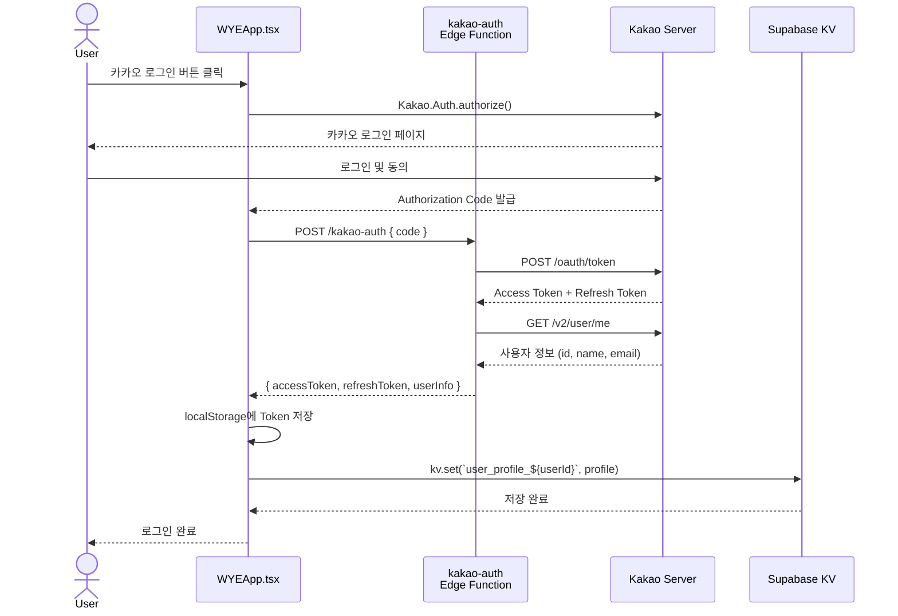
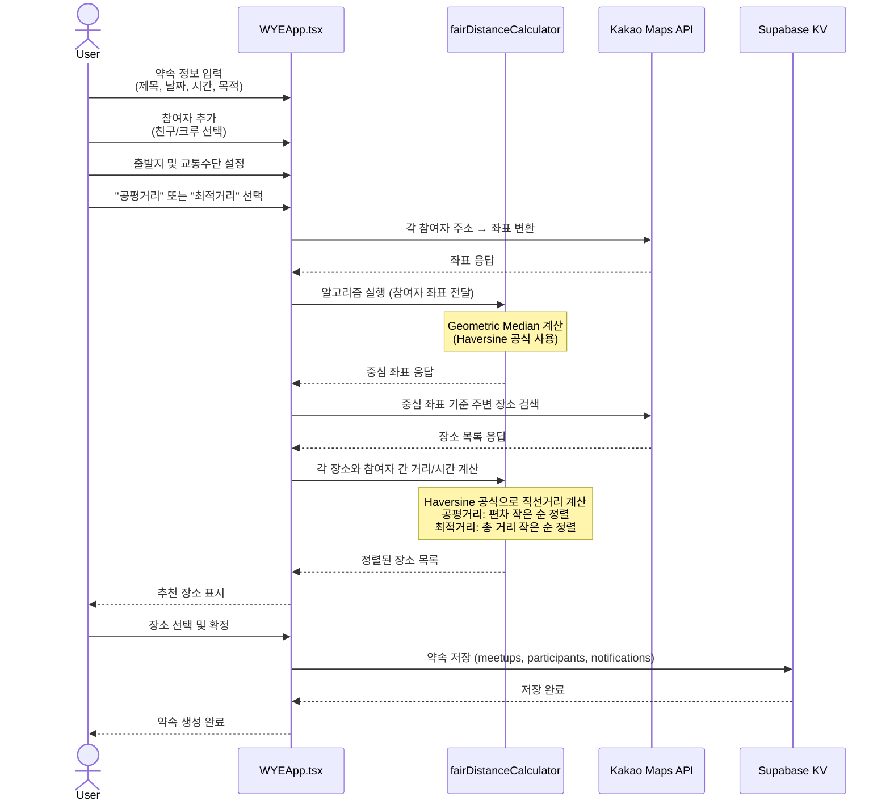
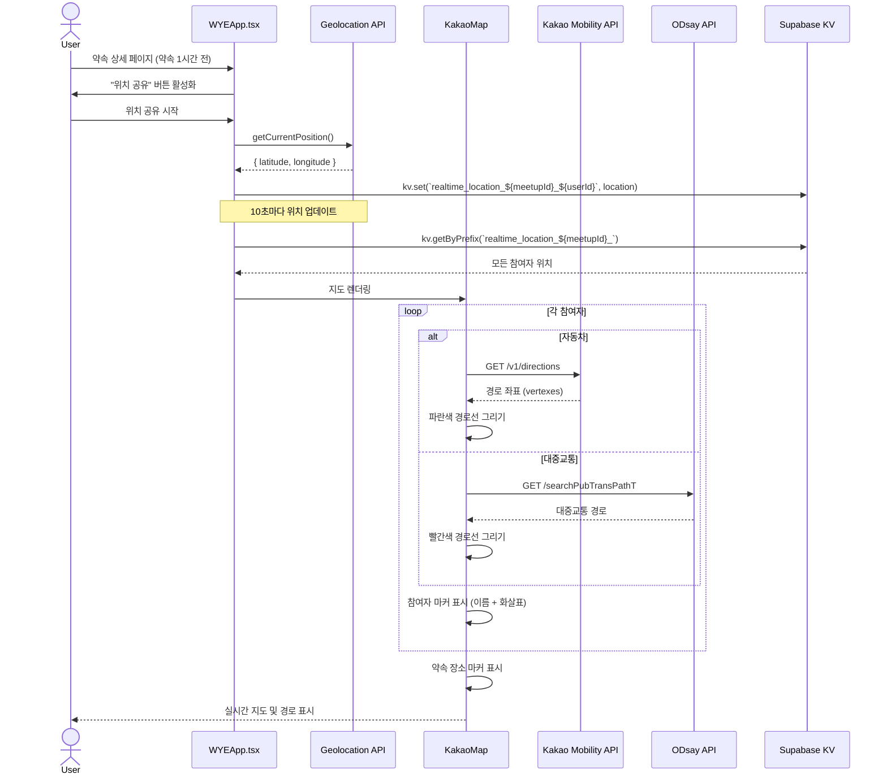
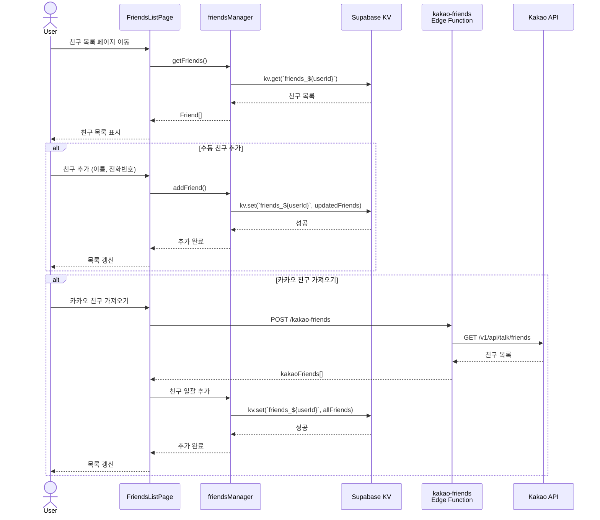

# WYE (Where You @) - 데이터 플로우 다이어그램

## 1. 로그인 플로우

```mermaid
sequenceDiagram
    actor User
    participant WYE as WYEApp.tsx
    participant EdgeFn as kakao-auth<br/>Edge Function
    participant Kakao as Kakao Server
    participant KV as Supabase KV

    User->>WYE: 카카오 로그인 버튼 클릭
    WYE->>Kakao: Kakao.Auth.authorize()
    Kakao-->>User: 카카오 로그인 페이지
    User->>Kakao: 로그인 및 동의
    Kakao-->>WYE: Authorization Code 발급
    WYE->>EdgeFn: POST /kakao-auth { code }
    EdgeFn->>Kakao: POST /oauth/token
    Kakao-->>EdgeFn: Access Token + Refresh Token
    EdgeFn->>Kakao: GET /v2/user/me
    Kakao-->>EdgeFn: 사용자 정보 (id, name, email)
    EdgeFn-->>WYE: { accessToken, refreshToken, userInfo }
    WYE->>WYE: localStorage에 Token 저장
    WYE->>KV: kv.set(`user_profile_${userId}`, profile)
    KV-->>WYE: 저장 완료
    WYE-->>User: 로그인 완료
```

## 2. 약속 생성 및 장소 추천 플로우

```mermaid
sequenceDiagram
    actor User
    participant WYE as WYEApp.tsx
    participant Calc as fairDistanceCalculator
    participant Kakao as Kakao Maps API
    participant KV as Supabase KV

    User->>WYE: 약속 정보 입력<br/>(제목, 날짜, 시간, 목적)
    User->>WYE: 참여자 추가<br/>(친구/크루 선택)
    User->>WYE: 출발지 및 교통수단 설정
    User->>WYE: "공평거리" 또는 "최적거리" 선택
    
    WYE->>Kakao: 각 참여자 주소 → 좌표 변환
    Kakao-->>WYE: 좌표 응답
    
    WYE->>Calc: 알고리즘 실행 (참여자 좌표 전달)
    
    Note over Calc: Geometric Median 계산<br/>(Haversine 공식 사용)
    
    Calc-->>WYE: 중심 좌표 응답
    
    WYE->>Kakao: 중심 좌표 기준 주변 장소 검색
    Kakao-->>WYE: 장소 목록 응답
    
    WYE->>Calc: 각 장소와 참여자 간 거리/시간 계산
    
    Note over Calc: Haversine 공식으로 직선거리 계산<br/>공평거리: 편차 작은 순 정렬<br/>최적거리: 총 거리 작은 순 정렬
    
    Calc-->>WYE: 정렬된 장소 목록
    WYE-->>User: 추천 장소 표시
    
    User->>WYE: 장소 선택 및 확정
    WYE->>KV: 약속 저장 (meetups, participants, notifications)
    KV-->>WYE: 저장 완료
    WYE-->>User: 약속 생성 완료
```

## 3. 실시간 위치 공유 및 경로 표시 플로우

```mermaid
sequenceDiagram
    actor User
    participant WYE as WYEApp.tsx
    participant Browser as Geolocation API
    participant KakaoMap
    participant Mobility as Kakao Mobility API
    participant ODsay as ODsay API
    participant KV as Supabase KV

    User->>WYE: 약속 상세 페이지 (약속 1시간 전)
    WYE->>User: "위치 공유" 버튼 활성화
    
    User->>WYE: 위치 공유 시작
    WYE->>Browser: getCurrentPosition()
    Browser-->>WYE: { latitude, longitude }
    WYE->>KV: kv.set(`realtime_location_${meetupId}_${userId}`, location)
    
    Note over WYE,Browser: 10초마다 위치 업데이트
    
    WYE->>KV: kv.getByPrefix(`realtime_location_${meetupId}_`)
    KV-->>WYE: 모든 참여자 위치
    
    WYE->>KakaoMap: 지도 렌더링
    
    loop 각 참여자
        alt 자동차
            KakaoMap->>Mobility: GET /v1/directions
            Mobility-->>KakaoMap: 경로 좌표 (vertexes)
            KakaoMap->>KakaoMap: 파란색 경로선 그리기
        else 대중교통
            KakaoMap->>ODsay: GET /searchPubTransPathT
            ODsay-->>KakaoMap: 대중교통 경로
            KakaoMap->>KakaoMap: 빨간색 경로선 그리기
        end
        KakaoMap->>KakaoMap: 참여자 마커 표시 (이름 + 화살표)
    end
    
    KakaoMap->>KakaoMap: 약속 장소 마커 표시
    KakaoMap-->>User: 실시간 지도 및 경로 표시
```

## 4. 친구 관리 플로우

```mermaid
sequenceDiagram
    actor User
    participant Friends as FriendsListPage
    participant Mgr as friendsManager
    participant KV as Supabase KV
    participant EdgeFn as kakao-friends<br/>Edge Function
    participant Kakao as Kakao API

    User->>Friends: 친구 목록 페이지 이동
    Friends->>Mgr: getFriends()
    Mgr->>KV: kv.get(`friends_${userId}`)
    KV-->>Mgr: 친구 목록
    Mgr-->>Friends: Friend[]
    Friends-->>User: 친구 목록 표시
    
    alt 수동 친구 추가
        User->>Friends: 친구 추가 (이름, 전화번호)
        Friends->>Mgr: addFriend()
        Mgr->>KV: kv.set(`friends_${userId}`, updatedFriends)
        KV-->>Mgr: 성공
        Mgr-->>Friends: 추가 완료
        Friends-->>User: 목록 갱신
    end
    
    alt 카카오 친구 가져오기
        User->>Friends: 카카오 친구 가져오기
        Friends->>EdgeFn: POST /kakao-friends
        EdgeFn->>Kakao: GET /v1/api/talk/friends
        Kakao-->>EdgeFn: 친구 목록
        EdgeFn-->>Friends: kakaoFriends[]
        Friends->>Mgr: 친구 일괄 추가
        Mgr->>KV: kv.set(`friends_${userId}`, allFriends)
        KV-->>Mgr: 성공
        Mgr-->>Friends: 추가 완료
        Friends-->>User: 목록 갱신
    end
```
