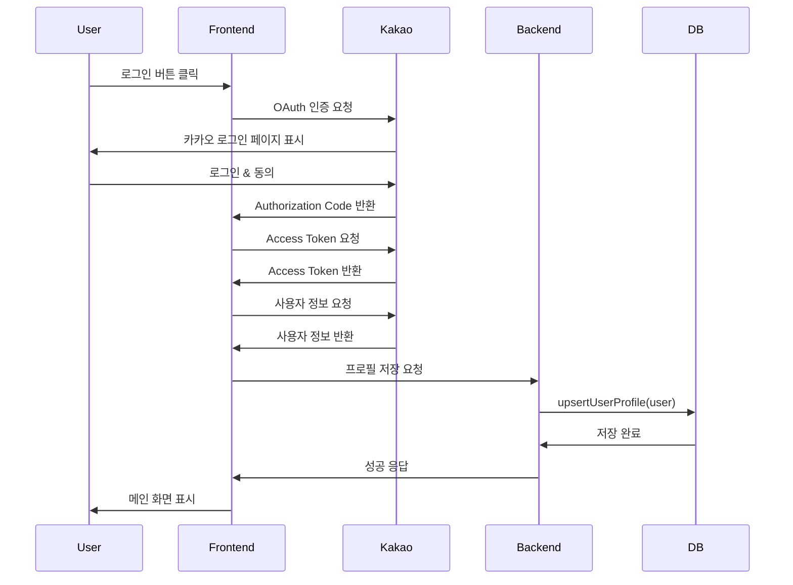
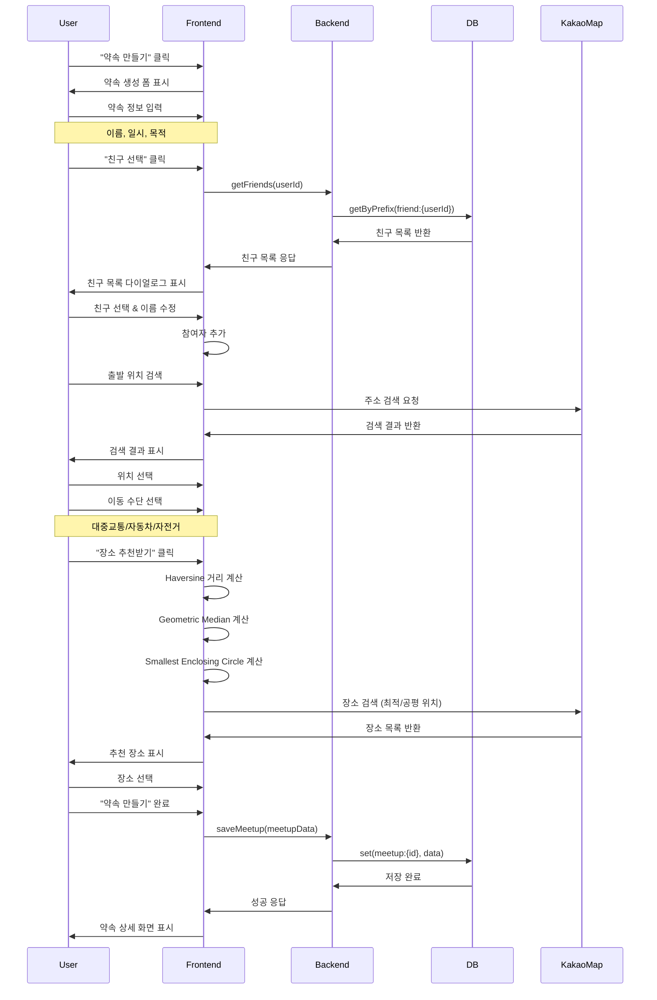
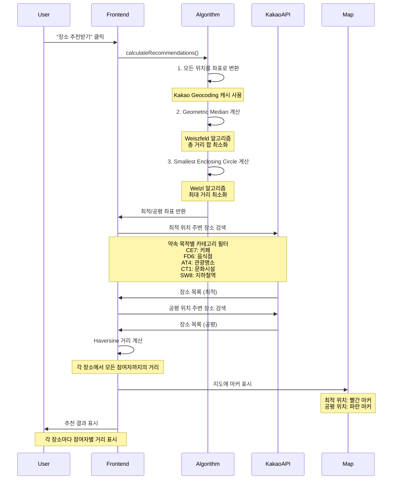
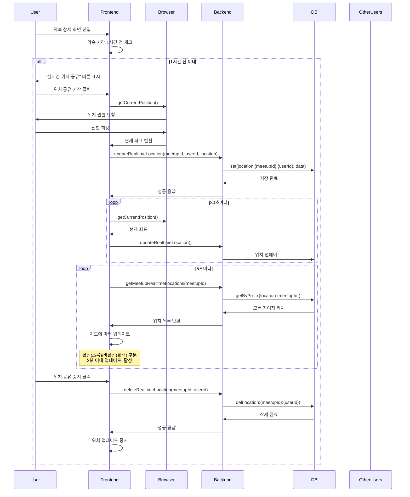
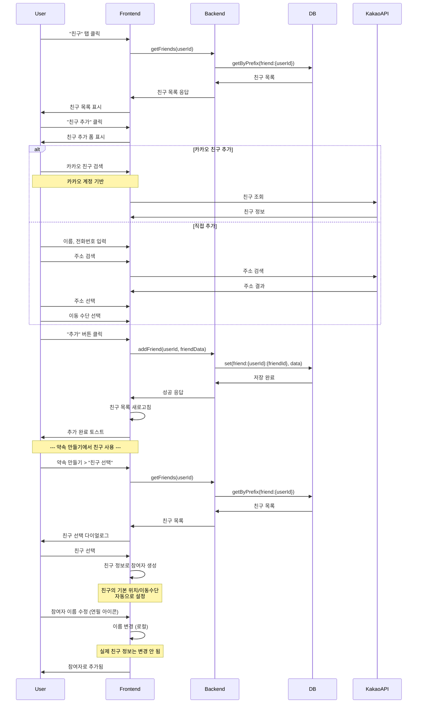
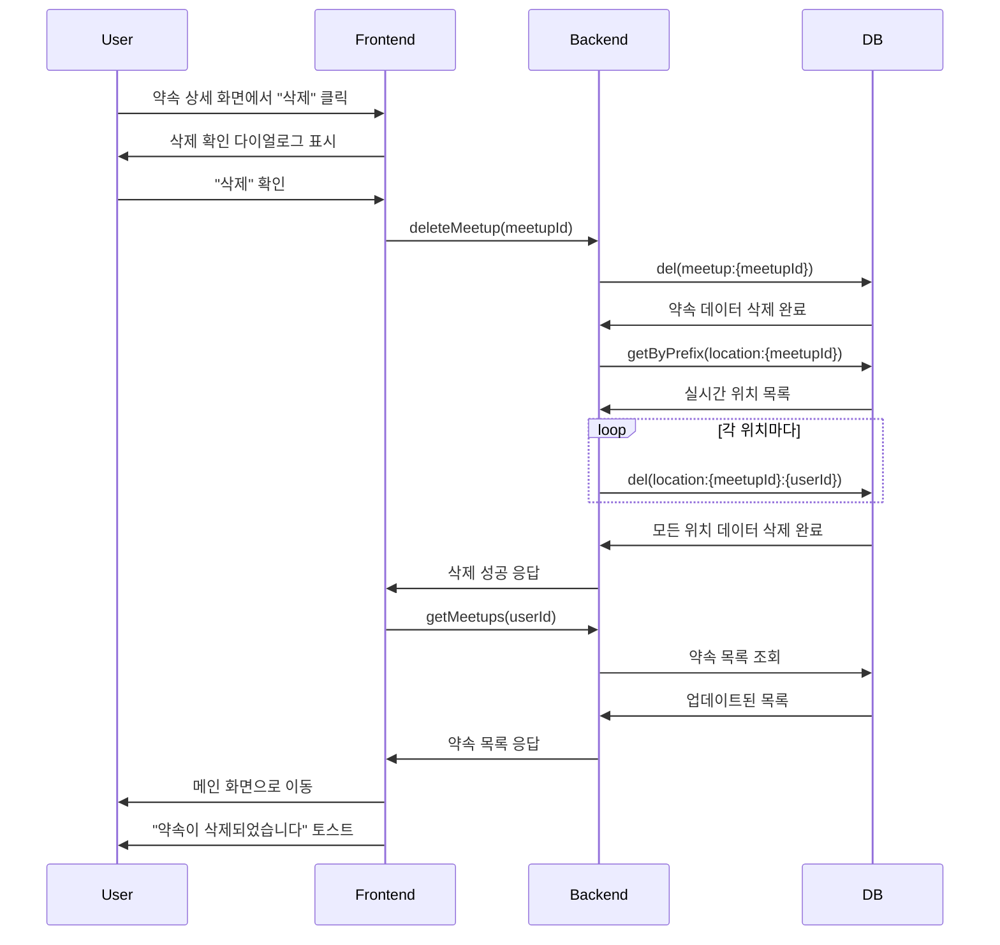
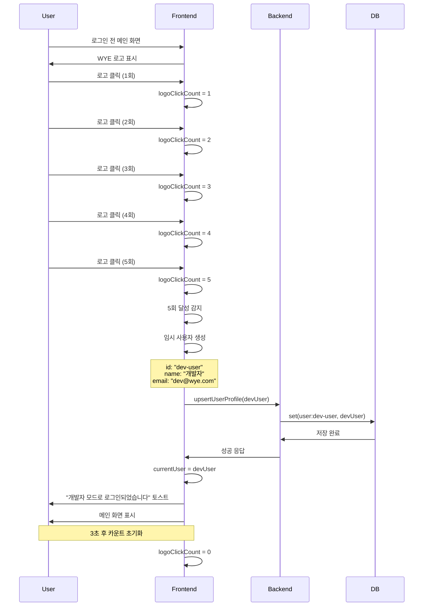

# WYE 시스템 설계 문서

## 목차
1. [시스템 개요](#시스템-개요)
2. [아키텍처](#아키텍처)
3. [모듈 설계](#모듈-설계)
4. [시퀀스 다이어그램](#시퀀스-다이어그램)
5. [데이터 모델](#데이터-모델)

---

## 시스템 개요

### 프로젝트명
**WYE (Where You meet Easily)** - 약속 장소 추천 웹 애플리케이션

### 주요 기능
- 카카오 로그인 연동 (소셜 로그인)
- 약속 생성 및 관리
- 친구 관리
- Haversine 공식 기반 거리 계산
- 최적/공평 위치 추천 (Geometric Median & Smallest Enclosing Circle)
- 실시간 위치 공유
- 카카오맵 기반 장소 검색 및 표시
- 알림 시스템

### 기술 스택
- **Frontend**: React, TypeScript, Tailwind CSS
- **Backend**: Supabase Edge Functions (Hono), Deno
- **Database**: Supabase KV Store (Postgres)
- **Auth**: Kakao OAuth 2.0, Supabase Auth
- **Map**: Kakao Maps API
- **Geolocation**: Browser Geolocation API
- **Distance Calculation**: Haversine Formula

---

## 아키텍처

### 시스템 아키텍처 다이어그램

```
┌─────────────────────────────────────────────────────────────┐
│                        Frontend (React)                     │
│  ┌──────────────┐  ┌──────────────┐  ┌──────────────┐       │
│  │   UI Layer   │  │  Components  │  │   Services   │       │
│  │  (WYEApp)    │  │  (Map, List) │  │  (API calls) │       │
│  └──────────────┘  └──────────────┘  └──────────────┘       │
└─────────────────────────────────────────────────────────────┘
                              │
                              ▼
┌─────────────────────────────────────────────────────────────┐
│                    External APIs                            │
│  ┌──────────────┐  ┌──────────────┐  ┌──────────────┐       │
│  │   Kakao      │  │  Supabase    │  │  Geolocation │       │
│  │   OAuth      │  │  Edge Func   │  │     API      │       │
│  └──────────────┘  └──────────────┘  └──────────────┘       │
└─────────────────────────────────────────────────────────────┘
                              │
                              ▼
┌─────────────────────────────────────────────────────────────┐
│                Backend (Supabase Edge Function)             │
│  ┌──────────────┐  ┌──────────────┐  ┌──────────────┐       │
│  │  Hono Server │  │  KV Store    │  │  Auth Layer  │       │
│  │  (Routes)    │  │  Manager     │  │              │       │
│  └──────────────┘  └──────────────┘  └──────────────┘       │
└─────────────────────────────────────────────────────────────┘
                              │
                              ▼
┌─────────────────────────────────────────────────────────────┐
│                    Database (Supabase)                      │
│  ┌──────────────────────────────────────────────────┐       │
│  │          KV Store Table (kv_store_679257f9)      │       │
│  │  - user:{userId}                                 │       │
│  │  - friend:{userId}:{friendId}                    │       │
│  │  - meetup:{meetupId}                             │       │
│  │  - location:{meetupId}:{userId}                  │       │
│  └──────────────────────────────────────────────────┘       │
└─────────────────────────────────────────────────────────────┘
```

### 3-Tier 아키텍처
1. **Presentation Layer**: React 컴포넌트 (UI/UX)
2. **Application Layer**: Supabase Edge Functions (비즈니스 로직)
3. **Data Layer**: Supabase KV Store (데이터 영속성)

---

## 모듈 설계

### 1. 인증 모듈 (Authentication Module)

**역할**:
- 카카오 OAuth 2.0 로그인 처리
- 개발자 모드 치트키 (로고 5회 클릭)
- 사용자 세션 관리
- 프로필 정보 관리

**주요 컴포넌트**:
- `KakaoLoginButton`: 카카오 로그인 UI
- `userProfile.ts`: 사용자 프로필 관리 서비스

**API Endpoints**:
- Kakao OAuth: `https://kauth.kakao.com/oauth/authorize`
- Kakao User Info: `https://kapi.kakao.com/v2/user/me`

**데이터 구조**:
```typescript
interface User {
  id: string;              // 카카오 ID
  name: string;            // 사용자 이름
  email: string;           // 이메일
  profileImage?: string;   // 프로필 이미지
  defaultLocation?: string;
  defaultTransport?: string;
  shareDefaultLocation?: boolean;
  shareDefaultTransport?: boolean;
}
```

---

### 2. 약속 관리 모듈 (Meetup Management Module)

**역할**:
- 약속 생성, 조회, 수정, 삭제
- 참여자 관리
- 약속 목적 설정 (카페, 식사, 관광명소, 문화시설, 지하철역)
- 약속 일시 관리

**주요 컴포넌트**:
- `CreateMeetupPage`: 약속 생성 통합 페이지
- `MeetupDetailPage`: 약속 상세 정보
- `MeetupListPage`: 약속 목록

**API Functions**:
- `saveMeetup(meetup)`: 약속 저장
- `getMeetups(userId)`: 사용자 약속 목록 조회
- `getMeetupDetail(meetupId)`: 약속 상세 조회
- `deleteMeetup(meetupId)`: 약속 삭제

**데이터 구조**:
```typescript
interface Meetup {
  id: string;
  name: string;
  date: string;            // YYYY-MM-DD
  time: string;            // HH:mm
  purpose: string;         // cafe | meal | tourist | culture | subway
  hostId: string;
  hostName: string;
  hostLocation: string;
  hostTransport: string;
  participants: Participant[];
  recommendedPlace?: {
    name: string;
    lat: number;
    lng: number;
    address: string;
    category?: string;
  };
  notifications?: NotificationSettings;
}

interface Participant {
  id: string;
  name: string;
  location: string;
  transport: string;
}
```

---

### 3. 친구 관리 모듈 (Friends Management Module)

**역할**:
- 친구 추가/삭제
- 친구 목록 조회
- 친구를 약속 참여자로 추가
- 친구 프로필 정보 관리

**주요 컴포넌트**:
- `FriendsListPage`: 친구 목록 화면
- `AddFriendDialog`: 친구 추가 다이얼로그

**API Functions**:
- `addFriend(userId, friendData)`: 친구 추가
- `getFriends(userId)`: 친구 목록 조회
- `deleteFriend(userId, friendId)`: 친구 삭제

**데이터 구조**:
```typescript
interface Friend {
  id: string;
  user_id: string;
  friend_kakao_id?: string;
  friend_name: string;
  friend_phone?: string;
  friend_address?: string;
  friend_transport?: string;
}
```

---

### 4. 장소 추천 모듈 (Place Recommendation Module)

**역할**:
- Haversine 공식으로 직선 거리 계산
- Geometric Median 계산 (최적 위치)
- Smallest Enclosing Circle 계산 (공평 위치)
- 카카오맵 API로 장소 검색
- 장소 필터링 (약속 목적에 맞는 카테고리)

**주요 컴포넌트**:
- `FairDistancePlaces`: 장소 추천 결과 표시
- `KakaoMap`: 지도 표시 및 마커
- `haversine.ts`: 거리 계산 유틸

**알고리즘**:
1. **최적 위치 (Geometric Median)**:
   - 모든 참여자로부터의 총 거리 합이 최소가 되는 지점
   - Weiszfeld 알고리즘 사용

2. **공평 위치 (Smallest Enclosing Circle)**:
   - 모든 참여자를 포함하는 최소 원의 중심
   - Welzl 알고리즘 사용

**데이터 구조**:
```typescript
interface RecommendedPlace {
  name: string;
  lat: number;
  lng: number;
  address: string;
  category?: string;
  recommendationType: 'optimal' | 'fair';
  distances?: {
    [participantName: string]: number;
  };
}
```

---

### 5. 실시간 위치 공유 모듈 (Real-time Location Sharing Module)

**역할**:
- 브라우저 Geolocation API로 현재 위치 추적
- 실시간 위치 업데이트 (주기적)
- 약속 시간 1시간 전부터 활성화
- 지도에 참여자 위치 표시

**주요 컴포넌트**:
- `RealtimeLocationMap`: 실시간 위치 지도
- `LocationShareToggle`: 위치 공유 토글
- `realtimeLocation.ts`: 위치 공유 서비스

**API Functions**:
- `updateRealtimeLocation(meetupId, userId, location)`: 위치 업데이트
- `getMeetupRealtimeLocations(meetupId)`: 약속의 모든 위치 조회
- `deleteRealtimeLocation(meetupId, userId)`: 위치 삭제
- `getCurrentPosition()`: 현재 위치 가져오기

**데이터 구조**:
```typescript
interface RealtimeLocation {
  userId: string;
  latitude: number;
  longitude: number;
  timestamp: number;       // Unix timestamp
}
```

**위치 업데이트 로직**:
- 위치 정확도: `enableHighAccuracy: true`
- 캐시 사용 안 함: `maximumAge: 0`
- 업데이트 주기: 30초마다
- 활성 상태 판정: 마지막 업데이트로부터 2분 이내

---

### 6. 지도 및 주소 검색 모듈 (Map & Address Search Module)

**역할**:
- 카카오맵 표시 및 제어
- 주소/장소명 검색
- 좌표 ↔ 주소 변환
- 마커 및 커스텀 오버레이 표시

**주요 컴포넌트**:
- `KakaoMap`: 기본 지도 컴포넌트
- `KakaoAddressSearch`: 주소 검색 입력
- `kakaoGeocode.ts`: 좌표-주소 변환 유틸

**Kakao Maps API**:
- Maps SDK: 지도 표시
- Local API: 장소 검색
- Geocoding API: 좌표-주소 변환

---

### 7. 알림 모듈 (Notification Module)

**역할**:
- 약속 알림 설정
- 시간 기반 알림 (30분 전, 1시간 전 등)
- 날짜 기반 알림 (1일 전, 3일 전 등)
- 사용자 정의 알림

**주요 컴포넌트**:
- `NotificationSettings`: 알림 설정 UI
- `notifications.ts`: 알림 관리 서비스

**데이터 구조**:
```typescript
interface NotificationSettings {
  enabled: boolean;
  timeEnabled: boolean;
  dateEnabled: boolean;
  reminderTime?: string;   // 30 | 60 | 120 | custom
  reminderDate?: string;   // 1 | 3 | 7 | custom
  customTime?: string;
  customDate?: string;
}
```

---

### 8. KV Store 모듈 (Key-Value Storage Module)

**역할**:
- 데이터 영속성 관리
- 키-값 쌍 저장/조회/삭제
- 프리픽스 기반 쿼리

**API Endpoints**:
- `POST /make-server-679257f9/kv/set`: 데이터 저장
- `GET /make-server-679257f9/kv/get`: 데이터 조회
- `POST /make-server-679257f9/kv/del`: 데이터 삭제
- `GET /make-server-679257f9/kv/getByPrefix`: 프리픽스 조회

**Key Patterns**:
```
user:{userId}                          // 사용자 프로필
friend:{userId}:{friendId}             // 친구 관계
meetup:{meetupId}                      // 약속 정보
location:{meetupId}:{userId}           // 실시간 위치
```

---

## 시퀀스 다이어그램

### 1. 카카오 로그인 시퀀스



**주요 단계**:
1. 사용자가 "카카오 로그인" 버튼 클릭
2. 카카오 OAuth 페이지로 리다이렉트
3. 사용자 동의 후 Authorization Code 받음
4. Code로 Access Token 교환
5. Token으로 사용자 정보 조회
6. 프로필 정보를 KV Store에 저장
7. 메인 화면으로 이동

---

### 2. 약속 생성 시퀀스



**주요 단계**:
1. 약속 기본 정보 입력 (이름, 일시, 목적)
2. 참여자 추가
   - 친구 목록에서 선택
   - 또는 직접 추가
   - 이름 수정 가능
3. 각 참여자의 출발 위치 설정
4. 각 참여자의 이동 수단 선택
5. 장소 추천 알고리즘 실행
   - 최적 위치 계산 (Geometric Median)
   - 공평 위치 계산 (Smallest Enclosing Circle)
6. 카카오맵 API로 주변 장소 검색
7. 사용자가 장소 선택
8. 약속 데이터를 KV Store에 저장

---

### 3. 장소 추천 알고리즘 시퀀스



**Haversine 공식**:
```
a = sin²(Δφ/2) + cos φ1 ⋅ cos φ2 ⋅ sin²(Δλ/2)
c = 2 ⋅ atan2(√a, √(1−a))
d = R ⋅ c
```
- φ: 위도 (라디안)
- λ: 경도 (라디안)
- R: 지구 반지름 (6,371km)

**알고리즘 선택**:
- **최적 위치**: 대중교통 이용자가 많을 때 유리 (총 이동 시간 최소화)
- **공평 위치**: 자동차 이용자가 많을 때 유리 (최대 이동 거리 최소화)

---

### 4. 실시간 위치 공유 시퀀스



**주요 특징**:
1. **시간 제한**: 약속 시간 1시간 전부터만 활성화
2. **위치 정확도**: `enableHighAccuracy: true`, `maximumAge: 0`
3. **업데이트 주기**: 
   - 자신의 위치 전송: 30초마다
   - 다른 참여자 위치 조회: 5초마다
4. **활성 상태 표시**:
   - 초록색 테두리: 2분 이내 업데이트
   - 회색 테두리: 2분 이상 업데이트 없음
5. **지도 표시**: 커스텀 말풍선 핀으로 이름 표시

---

### 5. 친구 추가 및 약속 참여자 등록 시퀀스



**친구 정보 활용**:
1. 친구의 기본 주소 → 참여자 출발 위치
2. 친구의 기본 이동수단 → 참여자 이동수단
3. 약속별로 이름 수정 가능 (별칭)
4. 실제 친구 데이터는 변경되지 않음

---

### 6. 약속 삭제 시퀀스



**삭제 작업**:
1. 약속 기본 데이터 삭제
2. 관련된 실시간 위치 데이터 모두 삭제
3. 약속 목록 새로고침
4. 메인 화면으로 이동

---

### 7. 개발자 모드 치트키 시퀀스



**치트키 특징**:
- 로그인 화면에서 로고 5회 연속 클릭
- 카카오 로그인 없이 임시 계정 생성
- 개발 및 테스트 용도
- 3초 안에 5회 클릭해야 함

---

## 데이터 모델

### KV Store 키 구조

```
┌─────────────────────────────────────────────────────────────┐
│                    KV Store Key Patterns                     │
└─────────────────────────────────────────────────────────────┘

1. 사용자 프로필
   key:   user:{userId}
   value: {
     id: string,
     name: string,
     email: string,
     profileImage?: string,
     defaultLocation?: string,
     defaultTransport?: string,
     shareDefaultLocation?: boolean,
     shareDefaultTransport?: boolean
   }

2. 친구 관계
   key:   friend:{userId}:{friendId}
   value: {
     id: string,
     user_id: string,
     friend_kakao_id?: string,
     friend_name: string,
     friend_phone?: string,
     friend_address?: string,
     friend_transport?: string
   }

3. 약속 정보
   key:   meetup:{meetupId}
   value: {
     id: string,
     name: string,
     date: string,
     time: string,
     purpose: string,
     hostId: string,
     hostName: string,
     hostLocation: string,
     hostTransport: string,
     participants: Participant[],
     recommendedPlace?: Place,
     notifications?: NotificationSettings
   }

4. 실시간 위치
   key:   location:{meetupId}:{userId}
   value: {
     userId: string,
     latitude: number,
     longitude: number,
     timestamp: number
   }
```

### 데이터 관계도

```
┌─────────────┐
│    User     │
│  (사용자)     │
└──────┬──────┘
       │
       │ 1:N
       ▼
┌─────────────┐
│   Friend    │
│   (친구)     │
└─────────────┘

┌─────────────┐
│    User     │
│  (주최자)     │
└──────┬──────┘
       │
       │ 1:N
       ▼
┌─────────────┐       1:N        ┌─────────────────┐
│   Meetup    │──────────────────│  Participant    │
│   (약속)     │                  │   (참여자)        │
└──────┬──────┘                  └─────────────────┘
       │
       │ 1:1
       ▼
┌─────────────┐
│    Place    │
│ (추천 장소)   │
└─────────────┘

┌─────────────┐
│   Meetup    │
│   (약속)     │
└──────┬──────┘
       │
       │ 1:N
       ▼
┌─────────────────┐
│ RealtimeLocation│
│ (실시간 위치)      │
└─────────────────┘
```

### 약속 목적별 카테고리 코드

| 약속 목적    | 카카오맵 카테고리 코드     | 설명      |
|------------|---------------------|-----------|
| cafe       | CE7                 | 카페       |
| meal       | FD6                 | 음식점      |
| tourist    | AT4                 | 관광명소    |
| culture    | CT1                 | 문화시설    |
| subway     | SW8                 | 지하철역    |

---

## 성능 최적화

### 1. 지도 로딩 최적화
- 카카오맵 SDK 스크립트 한 번만 로드
- 지도 인스턴스 재사용
- 마커/오버레이 효율적 관리

### 2. 위치 업데이트 최적화
- 자신의 위치: 30초마다 전송
- 다른 참여자 위치: 5초마다 조회
- 2분 이상 업데이트 없으면 비활성 표시

### 3. 거리 계산 최적화
- Haversine 공식으로 서버 호출 없이 클라이언트에서 계산
- 좌표 캐싱으로 중복 Geocoding 방지

### 4. 데이터 캐싱
- 사용자 프로필 로컬 상태 관리
- 친구 목록 캐싱
- 약속 목록 캐싱

---

## 보안 고려사항

### 1. 인증
- 카카오 OAuth 2.0 사용
- Access Token 안전한 저장
- 개발자 모드는 테스트 환경에서만 사용

### 2. 데이터 보호
- SUPABASE_SERVICE_ROLE_KEY는 서버에서만 사용
- 프론트엔드에서는 SUPABASE_ANON_KEY만 사용
- CORS 설정으로 허용된 출처만 API 호출 가능

### 3. 위치 정보
- 사용자 권한 요청 후에만 위치 접근
- 실시간 위치는 약속 참여자에게만 공유
- 약속 종료 후 위치 데이터 삭제 가능

---

## 향후 개선 방향

### 1. 실시간 통신
- WebSocket으로 실시간 위치 업데이트
- 참여자 간 채팅 기능

### 2. 알림 강화
- 푸시 알림 (Web Push API)
- 이메일/SMS 알림

### 3. 추천 알고리즘 개선
- 실제 대중교통 시간 고려 (향후 OSRM 또는 다른 API 고려 가능)
- 참여자별 가중치 설정
- 선호 장소 학습

### 4. UI/UX 개선
- 다크 모드
- 접근성 향상
- 모바일 앱 (React Native)

### 5. 소셜 기능
- 약속 히스토리
- 자주 만나는 친구 통계
- 약속 패턴 분석

---

## 버전 히스토리

- **v1.0** (2024-12)
  - 카카오 로그인 연동
  - 약속 생성 및 관리
  - Haversine 기반 거리 계산
  - 최적/공평 위치 추천
  - 실시간 위치 공유
  - 친구 관리
  - 개발자 모드 치트키

---

## 참고 자료

### API 문서
- [Kakao Developers](https://developers.kakao.com/)
- [Kakao Maps API](https://apis.map.kakao.com/)
- [Supabase Documentation](https://supabase.com/docs)

### 알고리즘
- [Haversine Formula](https://en.wikipedia.org/wiki/Haversine_formula)
- [Geometric Median (Weiszfeld)](https://en.wikipedia.org/wiki/Geometric_median)
- [Smallest Enclosing Circle (Welzl)](https://en.wikipedia.org/wiki/Smallest-circle_problem)

### 기술 스택
- [React](https://react.dev/)
- [TypeScript](https://www.typescriptlang.org/)
- [Tailwind CSS](https://tailwindcss.com/)
- [Hono](https://hono.dev/)
- [Deno](https://deno.land/)
